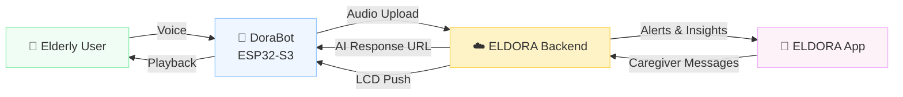
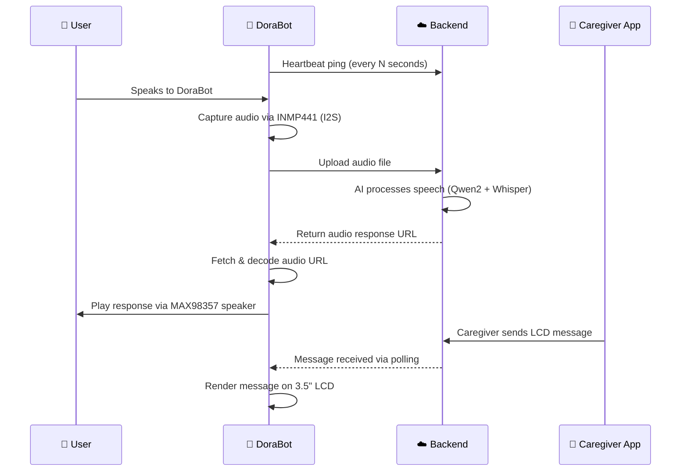

<div align="center">

# 🤖 DoraBot — ELDORA Home Companion Firmware

### *Protect. Respond. Recover.*

[](https://www.espressif.com/)
[](https://www.arduino.cc/)
[](https://github.com/)
[](https://github.com/lovyan03/LovyanGFX)
[](LICENSE)
[](https://github.com/)

<br/>

**ESP32-S3 firmware for the ELDORA DoraBot — the AI-powered home companion device for elderly safety, handling Wi-Fi provisioning, voice capture & playback, LCD status display, and real-time backend communication.**

[🌐 ELDORA Ecosystem](https://github.com/eldora-bm) · [📱 Mobile App](https://github.com/eldora-bm/eldora-app) · [🧠 AI Backend](https://github.com/eldora-bm/eldora-backend)

</div>

---

## 📌 Overview

DoraBot is the **physical voice companion device** in the ELDORA eldercare ecosystem. Mounted in the elderly user's home, it serves as the always-on interface between the user and ELDORA's AI backend — listening for voice input, playing back AI-generated responses, and displaying caregiver messages on its LCD screen.

> **DoraBot's role in the ELDORA ecosystem:**
> *"The human-facing terminal — a device grandma can talk to, that talks back, shows messages from family, and quietly keeps everyone informed."*

| | |
|---|---|
| **MCU** | ESP32-S3 |
| **Audio In** | INMP441 MEMS Microphone (I2S) |
| **Audio Out** | MAX98357 I2S Amplifier + Speaker |
| **Display** | 3.5" LCD (LovyanGFX) |
| **Power** | Li-ion battery + step-up/charger module |
| **Connectivity** | Wi-Fi 2.4GHz (provisioned via AP setup) |
| **Backend** | HTTP polling + audio URL streaming |

---

## 🌐 ELDORA Ecosystem

DoraBot is one of three core components of ELDORA:

```
ELDORA Ecosystem
├── 🛡️  DoraShield   — Fall detection wearable (TinyLSTM on ESP32-C3)
├── 🤖  DoraBot       — AI voice companion (this repo — ESP32-S3)
└── 📱  ELDORA App    — Caregiver dashboard (XGBoost + SHAP, Isolation Forest)
```



---

## ✨ Firmware Features

- 🛜 **Wi-Fi Provisioning AP** — on first boot, DoraBot creates a local access point for guided Wi-Fi setup via mobile browser
- 📲 **Mobile Pairing Token Flow** — secure one-time token exchange to bind DoraBot to a caregiver account
- 🎙️ **Voice Capture & Upload** — records user speech via INMP441 and streams audio to the backend
- 🔊 **Voice Playback** — fetches AI-generated audio response URLs from backend and plays them through the MAX98357 amplifier
- 📺 **LCD Status & Messages** — real-time status display and caregiver message rendering on the 3.5" screen
- 💓 **Heartbeat Reporting** — periodic backend pings to confirm device liveness
- 🔄 **Backend Command Polling** — continuously polls for new commands, messages, or audio queued from the backend
- 📶 **Wi-Fi Scan / Apply Flow** — allows runtime network switching without reflashing
- 🔋 **Battery & Signal Telemetry** — reports battery level and Wi-Fi RSSI to the backend dashboard

---

## 🛠️ Tech Stack

| Layer | Technology | Purpose |
|---|---|---|
| **MCU** | ESP32-S3 | Main processor with dual-core Xtensa LX7 |
| **Framework** | Arduino (ESP-IDF) | Firmware development environment |
| **Display Driver** | LovyanGFX | Hardware-accelerated LCD rendering |
| **Audio Capture** | ESP32 I2S Driver + INMP441 | PDM/I2S microphone input pipeline |
| **Audio Playback** | ESP8266Audio-compatible classes | Decode and stream audio to MAX98357 |
| **Networking** | WiFi / HTTPClient / WebServer / ESPmDNS | Provisioning AP, polling, backend HTTP |
| **Data Format** | ArduinoJson | JSON serialization for backend API |
| **Persistence** | Preferences (NVS) | Store Wi-Fi credentials, pairing tokens |

---

## 🔧 Hardware

| Component | Model | Role |
|---|---|---|
| **Microcontroller** | ESP32-S3 | Main firmware host |
| **Microphone** | INMP441 | I2S voice capture |
| **Amplifier** | MAX98357 | I2S audio output to speaker |
| **Speaker** | — | Voice playback output |
| **Display** | 3.5" LCD | Status and caregiver messages |
| **Power Management** | Step-up + charger module | Li-ion battery regulation |
| **Battery** | Li-ion cell | Portable power supply |

---

## 📁 Project Structure

```
DoraBot/
│
├── 📄 Eldora.ino               # Main firmware entry point — setup(), loop(), all constants
│
├── 📄 wifi_provision.h/.cpp    # AP mode setup, Wi-Fi scan, credential storage
├── 📄 pairing.h/.cpp           # Mobile pairing token flow
├── 📄 heartbeat.h/.cpp         # Backend heartbeat reporting
├── 📄 polling.h/.cpp           # Backend command & message polling
├── 📄 voice_capture.h/.cpp     # INMP441 I2S recording + audio upload
├── 📄 voice_playback.h/.cpp    # Audio URL fetch + MAX98357 I2S playback
├── 📄 lcd_display.h/.cpp       # LovyanGFX display rendering & messages
└── 📄 telemetry.h/.cpp         # Battery level + RSSI reporting
```

<details>
<summary><b>What each module does</b></summary>

<br/>

| File | Role |
|---|---|
| `Eldora.ino` | The **entry point**. Defines all hardware pins, backend constants, and the main event loop. |
| `wifi_provision` | The **onboarding flow**. Runs a local AP + web server so users can configure Wi-Fi from their phone without serial access. |
| `pairing` | The **security handshake**. Exchanges a one-time token with the backend to bind this device to a caregiver account. |
| `heartbeat` | The **pulse**. Sends periodic pings so the backend and caregiver dashboard know DoraBot is alive. |
| `polling` | The **inbox checker**. Continuously asks the backend if there's a new command, audio clip, or message to process. |
| `voice_capture` | The **ears**. Records audio from the INMP441 mic via I2S and uploads it to the backend for AI processing. |
| `voice_playback` | The **mouth**. Downloads and plays back AI-generated audio responses via the MAX98357 amplifier. |
| `lcd_display` | The **face**. Renders device status, connection state, and caregiver messages on the 3.5" LCD. |
| `telemetry` | The **vitals monitor**. Reports battery percentage and Wi-Fi signal strength to the dashboard. |

</details>

---

## ⚙️ How DoraBot Works



**In plain English:**
```
DoraBot boots → runs Wi-Fi provisioning if not configured
    → pairs with caregiver account via token
    → enters main loop:
        every N seconds → heartbeat to backend
        continuously    → poll for commands / messages / audio
        on user voice   → capture → upload → receive URL → playback
        on new message  → render on LCD
        on interval     → report battery + signal telemetry
```

---

## ⚙️ Configuration

Before flashing, update the following constants in `Eldora.ino`:

```cpp
// ── Backend ──────────────────────────────────────────────
#define BACKEND_URL       "https://your-backend-url.com"
#define DEVICE_KEY        "your-device-key-here"
#define PROVISIONING_SECRET "your-provisioning-secret"
#define FIRMWARE_VERSION  "1.0.0"

// ── Hardware Pins (update if wiring changes) ──────────────
#define I2S_MIC_SCK       14    // INMP441 clock
#define I2S_MIC_WS        15    // INMP441 word select
#define I2S_MIC_SD        32    // INMP441 data
#define I2S_AMP_BCLK      26    // MAX98357 bit clock
#define I2S_AMP_LRC       25    // MAX98357 left/right clock
#define I2S_AMP_DIN       22    // MAX98357 data in
```

> ⚠️ **Never commit real device keys or secrets to a public repository.** Use environment-specific header files or store secrets outside version control.

---

## 🚀 Build & Flash

### Prerequisites

- [Arduino IDE 2.x](https://www.arduino.cc/en/software) with ESP32 board support installed
- ESP32 board package: `https://raw.githubusercontent.com/espressif/arduino-esp32/gh-pages/package_esp32_index.json`

### Required Libraries

Install the following via Arduino Library Manager (`Sketch → Include Library → Manage Libraries`):

| Library | Purpose |
|---|---|
| `ArduinoJson` | JSON parsing for backend responses |
| `LovyanGFX` | LCD display driver |
| `Preferences` | NVS-backed persistent storage |
| `WiFi` / `HTTPClient` / `WebServer` / `ESPmDNS` | Networking stack (bundled with ESP32 core) |
| ESP8266Audio-compatible audio classes | I2S audio decode & playback |

### Flash Steps

```bash
# 1. Clone the repository
git clone https://github.com/eldora-bm/dorabot.git
cd dorabot

# 2. Open Eldora.ino in Arduino IDE

# 3. Select board:
#    Tools → Board → ESP32 Arduino → ESP32S3 Dev Module

# 4. Configure partition scheme if needed:
#    Tools → Partition Scheme → Huge APP (3MB No OTA)

# 5. Update constants in Eldora.ino (see Configuration section above)

# 6. Connect ESP32-S3 via USB, select the correct COM port

# 7. Upload
#    Sketch → Upload  (or Ctrl+U)
```

<details>
<summary><b>First Boot Sequence</b></summary>

<br/>

On first boot (or after clearing NVS), DoraBot will:

1. Start a local Wi-Fi access point named `ELDORA-Setup`
2. Connect your phone to `ELDORA-Setup`
3. Open a browser to `192.168.4.1` to enter your home Wi-Fi credentials
4. DoraBot saves the credentials and reboots into normal mode
5. On reconnect, DoraBot runs the pairing token flow to bind to a caregiver account

</details>

---

## 🔬 Firmware Details

<details>
<summary><b>Voice Capture Pipeline</b></summary>

<br/>

DoraBot uses the INMP441 MEMS microphone over I2S for audio capture:

```
User speaks
    → I2S DMA buffer fills with PCM samples
    → Silence detection via energy threshold
    → On voice activity: buffer audio frames
    → On silence end: finalize buffer
    → HTTP multipart upload to backend /audio/upload
    → Backend returns JSON { audio_url: "..." }
```

The capture window is bounded by configurable max duration to avoid runaway recordings.

</details>

<details>
<summary><b>Voice Playback Pipeline</b></summary>

<br/>

Once the backend returns an audio URL, DoraBot:

```
Receives audio_url from backend
    → HTTP GET to fetch audio stream (MP3/WAV)
    → Decode audio via ESP8266Audio-compatible classes
    → Feed decoded PCM samples to MAX98357 via I2S
    → Play through speaker
    → Signal playback complete to backend via heartbeat
```

</details>

<details>
<summary><b>LCD Rendering Strategy</b></summary>

<br/>

LovyanGFX is used for hardware-accelerated rendering on the 3.5" LCD. The display is divided into zones:

| Zone | Content |
|---|---|
| Top bar | DoraBot status (connecting / listening / speaking / idle) |
| Main area | Caregiver messages or AI response text |
| Bottom bar | Wi-Fi signal + battery level indicators |

Display updates are non-blocking and driven by state changes in the main loop.

</details>

<details>
<summary><b>Heartbeat & Polling Interval</b></summary>

<br/>

DoraBot uses two separate timers in the main loop:

| Timer | Default Interval | Purpose |
|---|---|---|
| Heartbeat | Every 30s | Confirms device liveness to backend |
| Command Poll | Every 5s | Checks for new messages, audio, or commands |
| Telemetry | Every 60s | Reports battery level and RSSI |

All intervals are configurable as constants in `Eldora.ino`.

</details>

---

## 👥 Team

<div align="center">

**ELDORA — BINUS BM Team**
*Passage to ASEAN Hackathon 2026*

| Name | Role |
|---|---|
| **Stanley Nathanael Wijaya** | Team Lead |
| **Lutfi Alvaro Pratama** | IoT Engineer |
| **Andrian Pratama** | Mobile Developer |
| **Khalisa Amanda Sifa Ghaizani** | Backend Developer |
| **Devon Nicholas** | AI Engineer |

</div>

---

## 📧 Contact

Have questions, want to collaborate, or interested in ELDORA?

| Channel | Details |
|---|---|
| 📧 Email | [stanley.n.wijaya7@gmail.com](mailto:stanley.n.wijaya7@gmail.com) |
| ✈️ Telegram | [@xstynwx](https://t.me/xstynwx) |
| 💬 Discord | `stynw7` |

---

<div align="center">

[](https://github.com/)
[](https://binus.ac.id/)

<br/>
Made with 🤍 by **BINUS BM Team** 🔥
</div>
